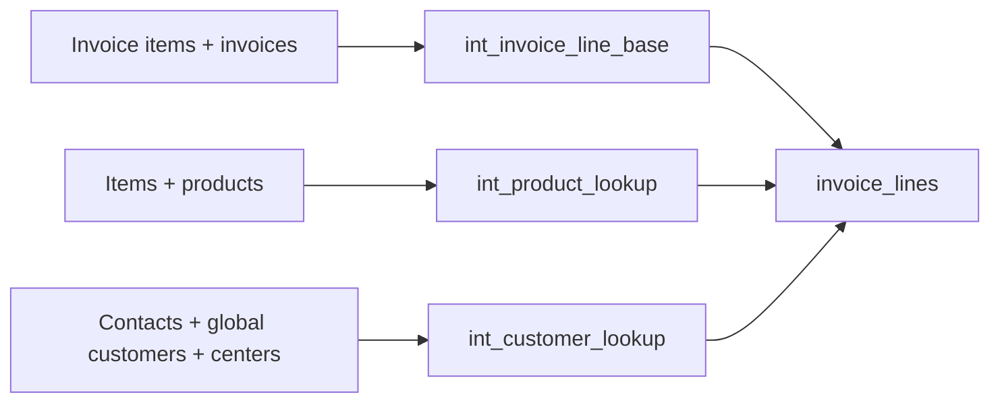

# Standardized invoice lines

A dbt model that preserves every source invoice line and its signed amount while
linking Confido products, global customers and distribution centers where the
supplied data supports a mapping. Unresolved references remain visible.

## Result

The updated live build created four views and passed all 26 selected tests on
September 10, 2026, including exact preservation of original quantity. The final view is `CONFIDO_INTERVIEWS.ZACHARY.INVOICE_LINES`.

| Measure | Lines |
|---|---:|
| Source and final, unique invoice-line IDs | 2,527 |
| Product matched / ambiguous / unmatched | 1,651 / 854 / 22 |
| Customer direct / parent / exact name | 901 / 10 / 5 |
| Customer ambiguous / unmapped / missing contact | 5 / 3 / 1,603 |
| Distribution center assigned | 0 |

Source amounts and currency are unchanged on every line. USD totals 6,605,614.49
across 788 lines; CAD totals 3,471.19 on one line. The remaining 1,738 lines have
missing currency and a source total of approximately 1,720,316.397969. **Do not
combine these totals or interpret missing currency as USD.** Amount units for
that group are not independently established; quantity times price often differs.

## Models and decisions



Each lookup has one row per company and remote reference before joining the base.
Products require exactly one accounting item and product candidate. Customer
resolution prefers an explicit internal ID, then one explicit parent contact,
then a unique trimmed, case-insensitive name in company/shared scope. Parent and
name assignments are **inferences**, distinguished by mapping status. Equal-name
ties stay unresolved. Centers require explicit contact references and cannot
conflict with the resolved customer.

The final view includes source references, internal IDs, mapping statuses and
candidate/invalid-reference counts. `amount` is the original `TOTAL_AMOUNT`, without
rounding, allocation or currency conversion. `quantity` retains the original invoice-item quantity, including nulls, as required
by the submission page. The earlier email described quantity as optional; the
model satisfies the stricter submission-page wording. Use mapping statuses to select only the provenance appropriate for
an analysis; `matched_parent` does not assert an exact direct-contact ID match.

## Run

Prerequisites: Python 3.11, the supplied Snowflake access and warehouse, and a
private authenticator session. From the repository root:

```sh
python3.11 -m venv .venv
.venv/bin/python -m pip install -r requirements.lock.txt
mkdir -p .profiles
cp profiles.example.yml .profiles/profiles.yml
chmod 700 .profiles
chmod 600 .profiles/profiles.yml
.venv/bin/python scripts/build_invoice.py
```

The launcher prompts privately for the password and fresh TOTP codes, and runs
`dbt build --select +invoice_lines --threads 1`. Credentials are held in the process,
not saved by the launcher. Multiple fresh-code prompts can occur. No credentials
or raw source export are included in this repository. The profile example has only
an environment-variable placeholder. Adapt authentication to your authorized
Snowflake account if you use a different method.

The local TOTP bridge supplies a separate passcode and disables token persistence
for the tested connector on macOS. It preserves server-required MFA. It is a small
adapter-specific compatibility helper, not a requirement to weaken authentication.
Dependency versions are pinned to the tested environment; installation on another
operating system has not been independently verified.

The target guard deliberately rejects writes outside `CONFIDO_INTERVIEWS.ZACHARY`
and checks that the assigned schema exists. Source tables are read-only. A reviewer
using a different authorized schema must intentionally adapt the guard and profile.

For offline syntax validation, after installation:

```sh
DBT_ENV_SECRET_CONFIDO_SNOWFLAKE_PASSWORD=offline-parse-only .venv/bin/dbt parse --profiles-dir .profiles
```

This does not authenticate or execute warehouse tests.

## Validation and remaining gaps

Tests cover source/model IDs, non-null amounts, lookup grain and candidate
resolution, missing/extra lines, unchanged source amounts, quantity and currency, and
internal-ID relationships. See [validation evidence](docs/validation.md).
Passing tests proves these checks, not the business meaning of inferred mappings.
Center relationship checks are vacuous for the current all-null center output.

All 13 supplied tables were inventoried and the identified mapping routes checked.
A separate reviewer independently reconstructed the results from the full export
and found no additional supported matches. See [source audit](docs/source-audit.md)
and [review disposition](docs/review.md). The audit is bounded by supplied data and
undocumented business semantics; it is not proof no other rule could exist.

The 854 ambiguous product lines lack a distinguishing product reference. The 22
unmatched lines have accounting-item records with names suggesting discounts,
services, adjustments or test entries. Customer identity alone does not establish
a shipping location. Further resolution needs authoritative item/customer/location
crosswalks and clarification of source currency and amount units.

With more time: confirm inferred customer policy, classify non-product accounting
lines with business input, add dangling-reference and status-consistency checks,
and introduce freshness/coverage monitoring. See [debrief guide](docs/debrief.md).
